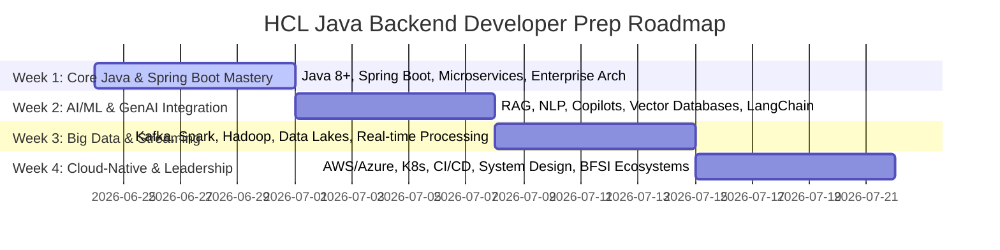

# HCL Java Backend Developer Interview Preparation Guide

Welcome to the ultimate preparation companion tailored for **Soyam Kapasiya** for the **Java Backend Developer (Java, Spring Boot)** role at **HCL**.

This document consolidates:
1. **Candidate Profile Integration**: Alignment of your experience with HCL's expectations, specifically highlighting your potential in GenAI and Big Data ecosystems.
2. **Structured 4-Week Interview Roadmap**: Detailed day-by-day core study focus area tailored for the HCL JD.
3. **Actionable Practice Map**: Specific coding drills and system design tasks to build.
4. **Targeted Q&A Preparation**: Deep-dive topics expected for this specific enterprise role.

---

## 👨‍💻 Candidate Profile Summary
* **Name**: Soyam Kapasiya
* **Role**: Java Backend Developer
* **Core Skills**: Java (8+), Spring Boot, Microservices, Enterprise Architecture.
* **Target Role**: HCL Java Backend Developer (102386)
* **Key Focus Areas for HCL**:
  * **AI/ML & GenAI Integration**: NLP, intelligent automation, copilots, RAG-based systems.
  * **Big Data Ecosystems**: Kafka, Spark, Hadoop, Data Lakes, Streaming architectures.
  * **Cloud-Native**: AWS/Azure, Kubernetes, CI/CD.
  * **Leadership**: Mentoring teams, influencing architectural decisions, BFSI domain.

---

## 📅 4-Week Interview Roadmap

This roadmap organizes your preparation into logical blocks, mapping HCL's specific technical requirements to specific timelines to ensure comprehensive coverage.

### 🔹 Week 1: Core Java, Spring Boot & Microservices
* **Day 1: Java 8+ Advanced Features**
  * Deep dive into Streams, Lambda expressions, Optional, and Concurrency utilities (CompletableFuture).
  * Memory Management and JVM Tuning for enterprise apps.
* **Day 2: Spring Boot & Enterprise Architecture**
  * Spring Boot Auto-configuration, Actuator, Profiles, and customized Starters.
  * Dependency Injection deep-dive, Spring Security (OAuth2, JWT).
* **Day 3: Microservices Design Patterns**
  * API Gateway, Service Discovery, Circuit Breaker (Resilience4j).
  * Saga Pattern for distributed transactions, Event Sourcing.
* **Day 4-5: Scalable Platform Design**
  * RESTful API design principles, GraphQL vs REST.
  * Designing for high availability, fault tolerance, and horizontal scalability.
* **Day 6-7: Relational & NoSQL Databases**
  * Advanced JPA/Hibernate (N+1, caching, locking).
  * When to use NoSQL (MongoDB/Cassandra) vs SQL (PostgreSQL).

### 🔹 Week 2: AI/ML & GenAI Integration
* **Day 8: Fundamentals of GenAI in Enterprise**
  * Understanding LLMs, Prompt Engineering, and model fine-tuning concepts.
  * Introduction to NLP and intelligent automation workflows.
* **Day 9: RAG (Retrieval-Augmented Generation)**
  * Understanding the RAG architecture (Document Loaders, Splitters, Embeddings, Vector Stores).
  * Implementing RAG systems using Java (e.g., Spring AI, LangChain4j).
* **Day 10: Vector Databases**
  * Concepts of vector embeddings and cosine similarity.
  * Hands-on with Pinecone, Milvus, or pgvector (PostgreSQL).
* **Day 11: Building Copilots & Assistants**
  * Designing conversational interfaces and context management.
  * Integration of AI agents with existing enterprise data.
* **Day 12-14: AI Platform Architecture**
  * Designing end-to-end scalable data + AI platforms.
  * Governance, security, and ethical considerations in enterprise AI.

### 🔹 Week 3: Big Data Ecosystems & Streaming
* **Day 15: Apache Kafka Deep Dive**
  * Kafka architecture, Brokers, Zookeeper/KRaft, Topics, Partitions.
  * Producer/Consumer configurations, exactly-once semantics, consumer groups.
* **Day 16: Event-Driven Architectures**
  * Real-time stream processing concepts.
  * Using Spring for Apache Kafka and Kafka Streams.
* **Day 17: Big Data Processing (Spark & Hadoop)**
  * Overview of Hadoop ecosystem (HDFS, YARN).
  * Apache Spark architecture, RDDs, DataFrames, Spark Streaming.
* **Day 18: Data Lakes & Warehousing**
  * Concepts of Data Lakes, Delta Lake, Snowflake.
  * Batch vs. Stream processing (Lambda/Kappa architectures).
* **Day 19-21: Integration & Real-time Pipelines**
  * Designing data-driven architectures leveraging Big Data pipelines.
  * Handling high-throughput, low-latency streaming data.

### 🔹 Week 4: Cloud-Native, DevOps & Leadership
* **Day 22: Cloud Platforms (AWS / Azure)**
  * Compute (EC2, AKS/EKS), Storage (S3, Blob), Databases (RDS, Cosmos DB).
  * IAM, Virtual Networks, and Cloud security best practices.
* **Day 23: Containerization & Kubernetes**
  * Docker best practices, multi-stage builds.
  * Kubernetes primitives (Deployments, Services, Ingress, ConfigMaps, Secrets).
* **Day 24: CI/CD & DevOps**
  * GitOps, Jenkins/GitHub Actions/GitLab CI.
  * Infrastructure as Code (Terraform, ARM/Bicep).
* **Day 25: React.js & Full Stack (Bonus)**
  * Review basic React.js concepts (Components, Hooks, State management) as per the "nice to have" requirement.
* **Day 26-27: Architectural Leadership & BFSI Domain**
  * Defining reference architectures and governance standards.
  * Mentoring best practices, code review guidelines, technical debt management.
  * BFSI (Banking, Financial Services, and Insurance) ecosystem nuances: regulatory compliance, PCI-DSS, high-security data handling.
* **Day 28: Mock Interviews & System Design Prep**
  * Practice designing a scalable intelligent automation platform.

---

## 🛠 Actionable Practice Map

Translate your knowledge into practical application with these coding drills and system design tasks.

### 🏗 1. GenAI + Spring Boot Sandbox Project
Build a **"Financial Document Copilot"**:
1. **Backend API (Spring Boot)**: Expose endpoints to upload financial reports (PDFs) and ask questions.
2. **Document Processing**: Use Apache Tika or PDFBox to extract text.
3. **Vectorization & RAG**: 
   * Integrate LangChain4j or Spring AI.
   * Generate embeddings via OpenAI/Ollama API and store them in a local Vector DB (e.g., pgvector).
4. **Query Generation**: When a user asks a question, retrieve the most relevant document chunks and send them as context to an LLM to generate the answer.

### 🏗 2. Streaming Data Pipeline (Kafka)
Build a **"Real-time Fraud Detection Pipeline"**:
1. **Producer**: A Spring Boot app generating simulated credit card transactions and publishing to a Kafka topic `raw-transactions`.
2. **Stream Processor (Kafka Streams)**: Consume `raw-transactions`, filter out valid ones, and flag anomalous transactions based on simple rules (e.g., amount > $10,000 or multiple countries in 1 hour) into a `flagged-transactions` topic.
3. **Consumer**: Consume `flagged-transactions` and save to PostgreSQL.

---

## 💬 Targeted Preparation Questions

Focus on these complex, architectural questions likely to be asked for a leadership/senior developer role:

1. **System Design (AI/Data)**: "How would you design an end-to-end platform that ingests real-time financial market data, processes it, and allows a GenAI copilot to answer complex analytical questions about market trends?"
2. **GenAI Integration**: "Explain the RAG architecture. How do you handle chunking strategies for large enterprise documents, and how do you ensure the LLM doesn't hallucinate?"
3. **Microservices & Resilience**: "In a cloud-native architecture, how do you handle distributed transactions across multiple microservices without locking the database?"
4. **Kafka & Streaming**: "Explain how consumer groups work in Kafka. What happens if a consumer fails? How do you ensure exactly-once processing in a high-throughput pipeline?"
5. **Leadership & Governance**: "How do you approach defining a reference architecture for a newly formed team? How do you balance delivering features quickly with maintaining high architectural standards?"
6. **Cloud & Kubernetes**: "Describe a CI/CD pipeline you would set up for a Spring Boot microservice deploying to an AKS/EKS cluster. How do you handle secrets?"

---
*Good luck with your preparation for HCL! Focus on demonstrating both deep technical expertise and strong architectural vision.*
